<!-- ═══════════════════════════════════════════════════════════ -->
<!--            1. LIVE TERMINAL — NEOFETCH                     -->
<!-- ═══════════════════════════════════════════════════════════ -->

<h3><code>Erick Salazar // Terminal Matrix</code></h3>

<table>
  <tr>
    <td valign="top">
      
    </td>
    <td valign="top">
      
    </td>
  </tr>
</table>

 

---

<!-- ═══════════════════════════════════════════════════════════ -->
<!--            2. CINEMATIC VENOM HEADER                       -->
<!-- ═══════════════════════════════════════════════════════════ -->

 

&nbsp;

&nbsp;

&nbsp;

  

  

---

<!-- ═══════════════════════════════════════════════════════════ -->
<!--            3. ARCHITECTURE & PIPELINE PILLARS              -->
<!-- ═══════════════════════════════════════════════════════════ -->

<h3><code>◉ Full-Stack & Engineering Architecture</code></h3>

<table border="0">
  <tr>
    <td align="left" width="20%">
      <b>🌐 WEB DEV</b> 
      • React / Next.js 
      • TypeScript / JS 
      • Tailwind CSS 
      • Clean Code
    </td>
    <td align="left" width="20%">
      <b>⚙️ BACKEND & APIS</b> 
      • Node.js / Express 
      • Python / Java / C# 
      • RESTful Architecture 
      • Auth & Security
    </td>
    <td align="left" width="20%">
      <b>💾 DATA & CLOUD</b> 
      • MySQL / PostgreSQL 
      • MongoDB 
      • Docker / Git 
      • Scalable Deployments
    </td>
    <td align="left" width="20%">
      <b>🎓 MY JOURNEY</b> 
      • UPC Software Eng 
      • Continuous Learning 
      • Problem Solving 
      • High Standards
    </td>
    <td align="left" width="20%">
      <b>🚀 FUTURE & SAAS</b> 
      • Enterprise Systems 
      • Scalable Web Apps 
      • Open Source 
      • Cloud Solutions
    </td>
  </tr>
</table>

 

---

<!-- ═══════════════════════════════════════════════════════════ -->
<!--            4. LIVE TERMINAL — CONTRIBUTIONS                -->
<!-- ═══════════════════════════════════════════════════════════ -->

<h3><code>Live Activity Heatmap</code></h3>

 

---

<!-- ═══════════════════════════════════════════════════════════ -->
<!--            5. FEATURED PROJECTS SHOWCASE                   -->
<!-- ═══════════════════════════════════════════════════════════ -->

<h3><code>Featured Projects & Future Deployments</code></h3>

Sistemas y proyectos destacados en desarrollo y listos para producción

<table border="0" width="100%">
  <tr>
    <td align="center" width="50%">
      
       
      <b>Enterprise Management & SaaS Platform</b> 
      Arquitectura modular, autenticación segura y gestión integral de datos
        
      
      
      
    </td>
    <td align="center" width="50%">
      
       
      <b>Interactive Digital Workspace & UI Portal</b> 
      Experiencia de usuario moderna, diseño reactivo y alta velocidad de carga
        
      
      
      
    </td>
  </tr>
  <tr>
    <td align="center" width="50%">
      
       
      <b>High-Performance RESTful Microservice</b> 
      Diseño de endpoints optimizados, validación de esquemas y seguridad perimetral
        
      
      
      
    </td>
    <td align="center" width="50%">
      
       
      <b>Cross-Platform Application & Cloud Engine</b> 
      Integración en la nube, consumo de datos en tiempo real y componentes reutilizables
        
      
      
      
    </td>
  </tr>
</table>

 

---

<!-- ═══════════════════════════════════════════════════════════ -->
<!--            6. TECH ARSENAL                                 -->
<!-- ═══════════════════════════════════════════════════════════ -->

<h3><code>Tech Arsenal & Tools</code></h3>

<table>
<tr>
<td align="center" width="50%">

**Frontend & UI Development**

</td>
<td align="center" width="50%">

**Backend, Data & Cloud**

</td>
</tr>
<tr>
<td align="center" colspan="2">

**Developer Workflow & DevOps**

</td>
</tr>
</table>

 

---

<!-- ═══════════════════════════════════════════════════════════ -->
<!--            7. GITHUB METRICS & STATS                       -->
<!-- ═══════════════════════════════════════════════════════════ -->

<h3><code>Activity Metrics & Language Stats</code></h3>

<table border="0">
  <tr>
    <td align="center" width="50%">
      
    </td>
    <td align="center" width="50%">
      
    </td>
  </tr>
</table>

 

---

<!-- ═══════════════════════════════════════════════════════════ -->
<!--            8. CONNECT & SOCIAL ORBIT                       -->
<!-- ═══════════════════════════════════════════════════════════ -->

<h3><code>Connect & Collaborate</code></h3>

 

&nbsp;

&nbsp;

  

<table border="0" cellpadding="0" cellspacing="0">
<tr>
<td align="center" valign="middle">

</td>
</tr>
</table>

 

---

